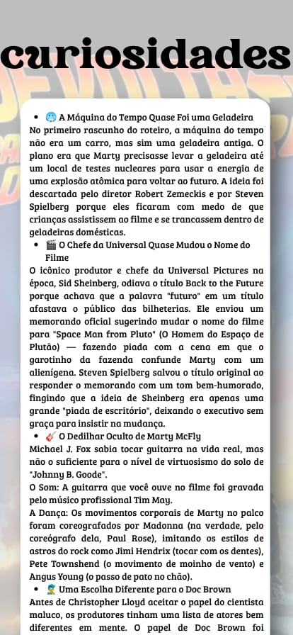
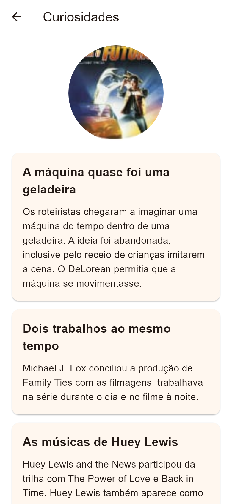

# Tela de curiosidades

**Finalidade:** apresentar informações curtas sobre os bastidores.

| Elemento | Widget | Classe, atributo ou método |
| --- | --- | --- |
| Título e voltar | AppBar | TelaConteudo; Secao.titulo |
| Imagem | ClipOval, Image.asset | Secao.imagem |
| Curiosidades | Card, Column, Text | Secao.itens; ItemTexto.titulo e texto |
| Rolagem | ListView | TelaConteudo.build |

A seção `curiosidades` é enviada como parâmetro. A lista inclui a ideia da geladeira, a agenda de Michael J. Fox, as músicas, os cenários e os carros usados na produção.

## Captura da implementação

Renderizada pelo motor Flutter em teste de widgets, com área de 390 × 844 e fonte Arial de apoio. Não é captura de emulador Android; a tipografia pode variar no celular.
