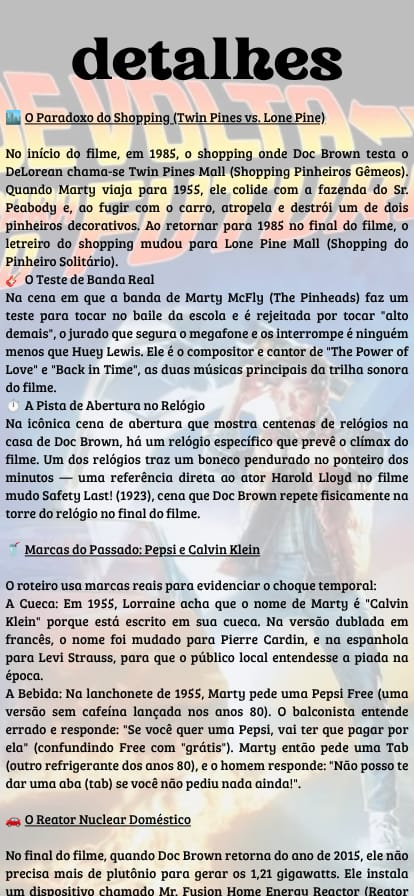
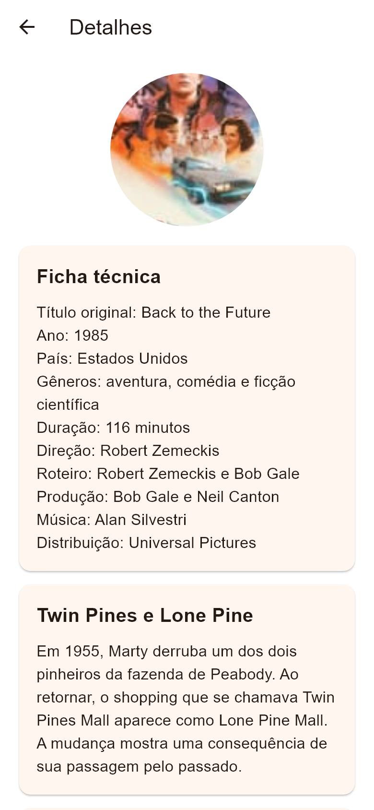

# Tela de detalhes

**Finalidade:** exibir ficha técnica e detalhes das cenas.

| Elemento | Widget | Classe, atributo ou método |
| --- | --- | --- |
| Título e voltar | AppBar | TelaConteudo; Secao.titulo |
| Imagem | ClipOval, Image.asset | Secao.imagem |
| Ficha técnica e observações | Card, Column, Text | Secao.itens; ItemTexto.titulo e texto |
| Rolagem | ListView | TelaConteudo.build |

A seção `detalhes` é enviada como parâmetro. O primeiro item traz a ficha técnica e os seguintes apresentam detalhes narrativos do filme.

## Captura da implementação

Renderizada pelo motor Flutter em teste de widgets, com área de 390 × 844 e fonte Arial de apoio. Não é captura de emulador Android; a tipografia pode variar no celular.
