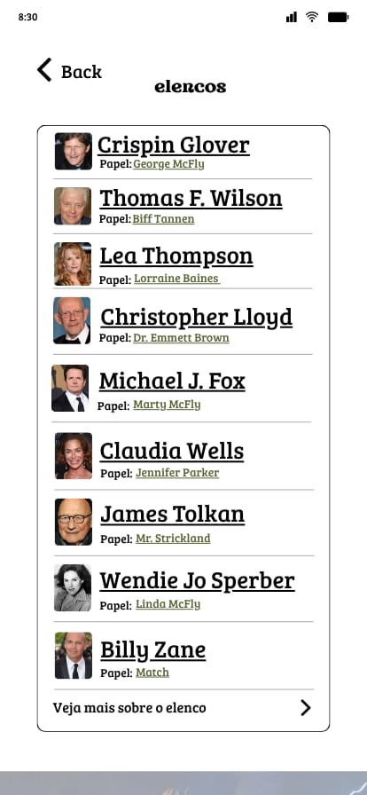
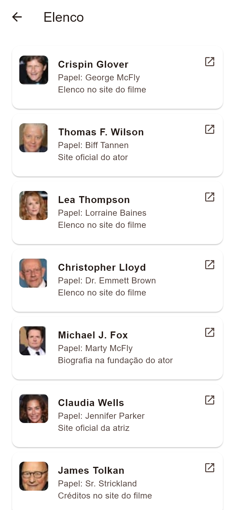

# Tela de elenco

**Finalidade:** relacionar atores e personagens e abrir informações externas.

| Elemento | Widget | Classe, atributo ou método |
| --- | --- | --- |
| Título e voltar | AppBar | TelaElenco |
| Lista de atores | ListView, Card, ListTile | Filme.elenco |
| Fotografia | ClipRRect, Image.asset | Ator.imagem |
| Nome e personagem | Text | Ator.nome e personagem |
| Identificação do destino | Text | Ator.tipoLink |
| Abrir página | ListTile.onTap | abrirLink; Ator.link |
| Mais sobre elenco | OutlinedButton.icon | Filme.siteElenco |

Os links de Claudia Wells e Thomas F. Wilson levam a seus sites oficiais. O de Michael J. Fox leva à biografia na fundação do ator. Os outros destinos são páginas de elenco ou créditos do site do filme e estão identificados como tal.

## Captura da implementação

Renderizada pelo motor Flutter em teste de widgets, com área de 390 × 844 e fonte Arial de apoio. Não é captura de emulador Android; a tipografia pode variar no celular.
