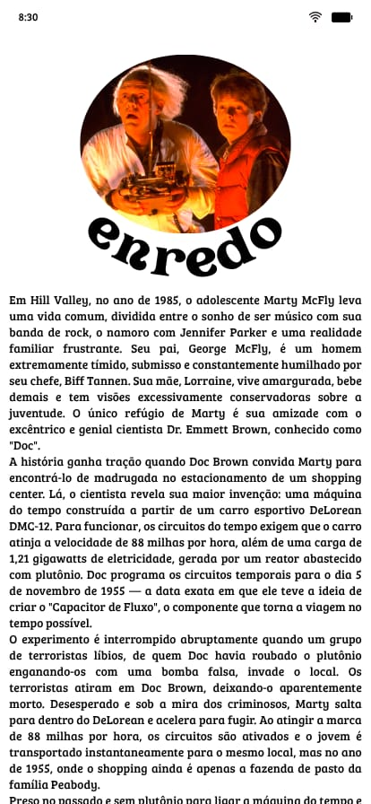
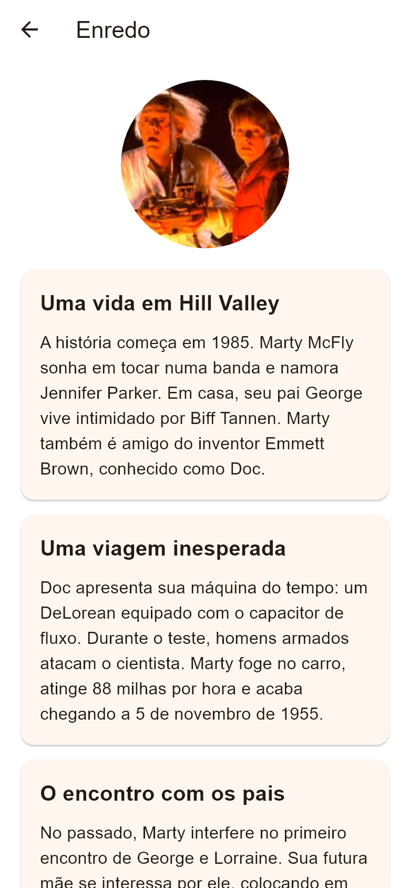

# Tela de enredo

**Finalidade:** contar os acontecimentos principais, incluindo o desfecho identificado como spoiler.

| Elemento | Widget | Classe, atributo ou método |
| --- | --- | --- |
| Título e voltar | AppBar | TelaConteudo; Secao.titulo; retorno automático pelo Navigator |
| Imagem | ClipOval, Image.asset | Secao.imagem |
| Etapas da história | Card, Column, Text | Secao.itens; ItemTexto.titulo e texto |
| Rolagem | ListView | TelaConteudo.build |

A tela recebe como parâmetro a seção cujo `id` é `enredo`. Os cartões são criados percorrendo a lista `itens` carregada do JSON.

## Captura da implementação

Renderizada pelo motor Flutter em teste de widgets, com área de 390 × 844 e fonte Arial de apoio. Não é captura de emulador Android; a tipografia pode variar no celular.
