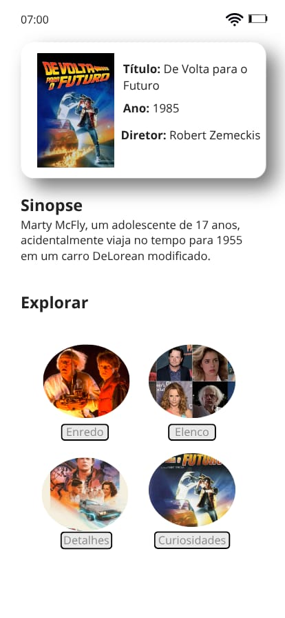
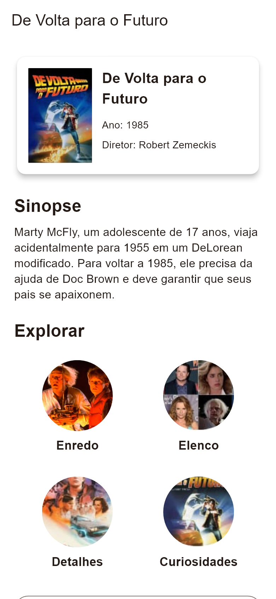

# Tela inicial

**Finalidade:** apresentar o filme e permitir acesso às quatro seções.

| Elemento | Widget | Classe, atributo ou método |
| --- | --- | --- |
| Cartão do filme | Card, Row, Expanded | TelaInicio; filme |
| Cartaz | Image.asset | Filme.capa |
| Dados básicos | Text | Filme.titulo, ano, diretor |
| Sinopse | Text | Filme.sinopse |
| Opções de exploração | Wrap, InkWell, ClipOval | Filme.secoes; Secao.imagem e titulo |
| Abrir seção | Navigator.push, MaterialPageRoute | TelaConteudo(secao: secao) |
| Abrir elenco | Navigator.push | TelaElenco(filme: filme) |
| Site oficial | OutlinedButton.icon | abrirLink; Filme.site |
| Rolagem | ListView | TelaInicio.build |

## Captura da implementação

Renderizada pelo motor Flutter em teste de widgets, com área de 390 × 844 e fonte Arial de apoio. Não é captura de emulador Android; a tipografia pode variar no celular.
